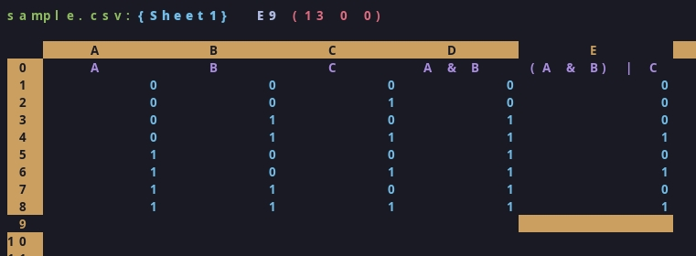

# **SIMPL**  - A **SIM**ple **P**rogrammable **L**ogic library
A Simple programmable logic library that can be used to perform logic operations.

It can generate true tables, program custom operators and much more

# Compiling example
```bash
gcc -o example.exe example.c libspl.c
```

# OUTPUT from example
```bash
C: 1110, len=4
E: 10101000, len=8
A,B,D,C,E
0,0,0,0,0
0,0,1,0,0
0,1,0,1,0
0,1,1,1,1
1,0,0,1,0
1,0,1,1,1
1,1,0,1,0
1,1,1,1,1
```
## The Truth Table

