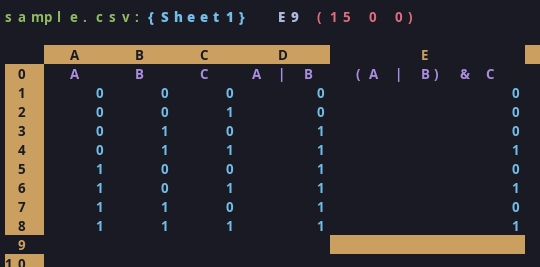

# **SIMPL**  - A **SIM**ple **P**rogrammable **L**ogic library
## STILL IN DEVELOPMENT
A Simple programmable logic library that can be used to perform logic operations.

It can generate true tables, program custom operators and much more

It works like on the [truth set model](./doc/SSRN-id4028578.pdf) but I have built my own instruction set, so the process differ

The entire Result set is saved in a 32-bit integer, that can be easily used for more operations.

For now, this library can only work with 5 individual variables, since it has only 32 bits to work with.

# Compiling example
```bash
gcc -o example.exe example.c libspl.c
```

# OUTPUT from example.c
```bash
A,B,C,A|B,(A|B)&C
0,0,0,0,0
0,0,1,0,0
0,1,0,1,0
0,1,1,1,1
1,0,0,1,0
1,0,1,1,1
1,1,0,1,0
1,1,1,1,1
```
Let’s assume:
P: Jasmine is invited.
Q: Kanti is invited.
R: Samir is invited.
The following three conditions should be met:
a) P → ¬R: If Jasmine is invited, Samir will not be invited.
## The Truth Table

